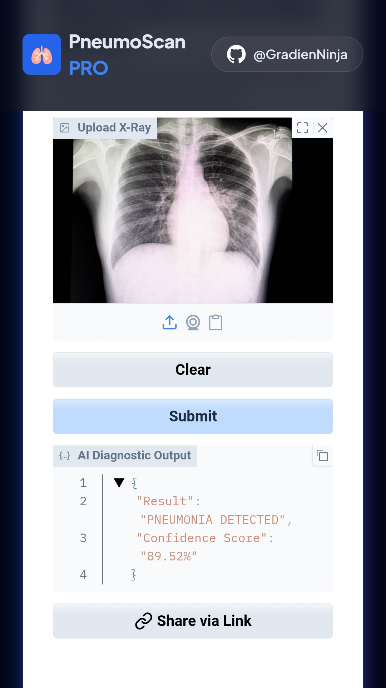

# 🫁 PneumoScan AI

> A deep learning model that detects pneumonia from chest X-ray images with 90%+ accuracy.

[](https://pneumonia-scan-ai.netlify.app/)
[]()
[](https://github.com/GradienNinja)

---

## 🔗 Live Demo

**[https://pneumonia-scan-ai.netlify.app/](https://pneumonia-scan-ai.netlify.app/)**

Upload a chest X-ray and get an instant diagnosis — Normal or Pneumonia Detected — with a confidence score.

---



## 📊 Dataset

- **Source:** [Chest X-Ray Images (Pneumonia) — Kaggle](https://www.kaggle.com/datasets/paultimothymooney/chest-xray-pneumonia)
- **Size:** 5,800+ clinical images
- **Classes:** `NORMAL` | `PNEUMONIA` (Viral & Bacterial)

---

## 🧠 Model Architecture

Built on **MobileNetV2** with transfer learning — frozen base for feature extraction, custom head for binary classification.

```
Input (any size RGB)
    ↓
Resizing → 224 × 224
Rescaling → ÷ 255
    ↓
MobileNetV2 (frozen) — 16 inverted residual blocks
    ↓
GlobalAveragePooling2D
    ↓
Dense(128, ReLU)
    ↓
Dropout(0.3)
    ↓
Dense(1, Sigmoid) → Pneumonia probability
```

| Component | Detail |
|---|---|
| Base Model | MobileNetV2 (ImageNet weights, frozen) |
| Input Shape | 224 × 224 × 3 |
| Optimizer | Adam (lr=0.001) |
| Output | Sigmoid — binary probability |
| Regularization | 30% Dropout |
| Model Size | ~11.4 MB |
| Accuracy | 90%+ |

---

## 🛡️ Input Validation — Saturation Gate

To prevent false positives on non-medical images, a **HSV Saturation Gate** is implemented.

Since chest X-rays are grayscale, any uploaded image with a color saturation mean above a set threshold is **rejected** before reaching the model. This prevents random photos from receiving a diagnosis.

---

## ☁️ Deployment Stack

| Layer | Technology |
|---|---|
| Model Serving | Hugging Face Spaces (Gradio + TensorFlow-CPU) |
| Frontend | Netlify (custom Tailwind CSS portal) |
| Bridge | Optimized iframe |

---

## 📁 Repository Structure

```
PneumoScan-AI/
├── model/
│   └── pneumonia_pipeline_model.h5   # Trained Keras model
├── assets/
│   └── preview.png                   # Site screenshot
├── README.md
└── .gitignore
```

---

## ⚠️ Disclaimer

This is a **research and educational project**. It is **not** a certified medical device and should **not** be used as a substitute for professional medical diagnosis. Always consult a qualified healthcare professional.

---

## 👨‍💻 Author

**Sheikh Sadi Asif** — Platform Architect & AI Engineer

[](https://github.com/GradienNinja)

---

*© 2026 AstroLabSoft AI Lab | Medical Research Division*
